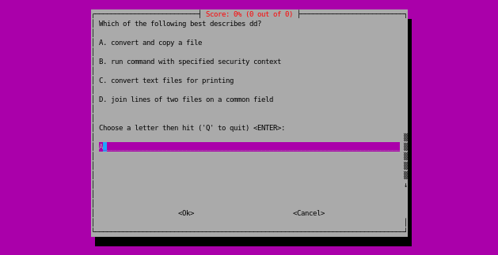
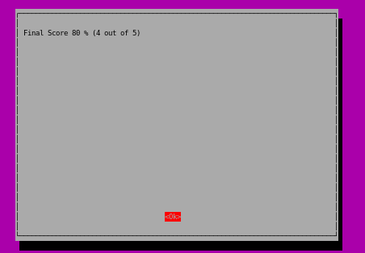

# fct (Flashcard TUI)
## Description
This repository contains a pure-Bash program that enables you to review your flashcards in your terminal.
    Usage: ./bin/fct FILE

On most Linux distributions you should be able to run this program without installing ANY additional dependencies. It relies only on common command-line utilities, and the whiptail command. Whiptail is installed by default on several Ubuntu, Debian, and RHEL hosts that I looked at, if not it should be included in the default repositories.

Reviewing textbook terms lead me to making this repo. There's plenty of practical utility of being able to quiz yourself on glossary terms on your local system.

The whiptail utility is unique because it's one of the ONLY tools that allows you to make a terminal interface with pure-Bash. What do I mean by this? In Bash there's no way for you to interact with previous lines you print (unless you use terminal escape codes). The most you can do is rewrite the current line by first printing the '\r' (CR) character. The closest alternative to whiptail I've seen is the dialog utility, but whiptail is a drop-in replacement that seems to be installed by default whereas dialog isn't. To make nice-looking TUIs, the best solution is using the ncurses library for C/C++ though there are wrappers for most programming languages like the curses module which is included in the Python standard library. But in Bash you can use the tput command to query the terminfo database for escape sequences, alternatively you can use printf or echo to output the escape codes directly. For some examples of Bash projects that make extensive use of terminal escape sequences are [bashtop](https://github.com/aristocratos/bashtop) and [fff](https://github.com/dylanaraps/fff).

I consider this program to be in a minimal working state. I plan on including support for different file formats, question types, parsing speed, and arguments that alter the behavior.

The "FILE" argument you pass to this script is a regular file that is formatted like this:

    KEYPHRASE: DEFINITION
    
    KEYPHRASE: DEFINITION
    
There must be a blank line separating terms, and you can have one alternate phrase wrapped in parentheses before the semi-colon. i.e.:

    KEYPHRASE (ABBREVIATION): DEFINITION
    
    KEYPHRASE (ABBREVIATION): DEFINITION
    
As an example I'm including a coreutils.txt file in this repo which enumerates all the programs from the GNU coreutils package. After cloning this repo you'd run:

    ./bin/fct ./examples/coreutils.txt

I generated the coreutils file by running this multi-step pipeline command on my Ubuntu system:

    for exe in $(apt-file list coreutils | grep bin | awk '{ print $2 }'); do whatis $exe | awk '{ if($2 == "(1)" || $2 == "(8)") print }'; done | awk '{ printf $1 ":"; for(i=4;i<=NF;i++) printf $(i) " "; printf "\n\n"  }' > coreutils.txt

What this fct interface looks like:

You enter a letter and the program will keep track of your score. Once you enter Q at the prompt, it'll show you your final score and you can hit <ENTER> to exit.

Please post an issue on this github repo if you encounter any bugs or see some room for improvement.
